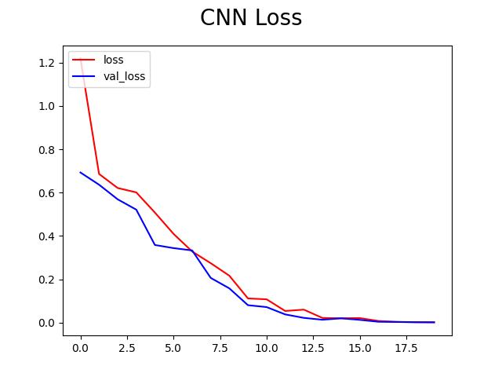
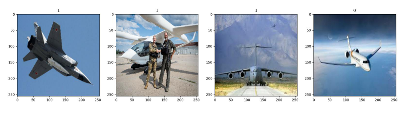

# Airplanes Classification


The goal of this project is to make a Convolucional Neural Network (CNN) that can classify what type of plane is represented in the image. Were chosen 2 types of airplanes: commercial and military. **Data were collected from Google Images**. 



<br>

**Goal**
- Classify if an image is of a commercial or military airplane.

Where images with label = 0, mean commercial airplanes, while those with label = 1, military ones, as you can see in the images bellow.




## Installation
1. First, it's needed Anconda Distribution installed in the system.

2. With Anconda already installed,deactivate the default environment if it's activated.
```bash
conda deactivate
```

3. Run in the project's root directory the following code to create the new env. Run in the terminal:
```bash
conda env create -f environment.yml
```

4. Now, it's time to activate the new env.
```bash
conda activate env_name
```
5. **The code can be executed using the interactive window of Jupyter Notebook extension**.
