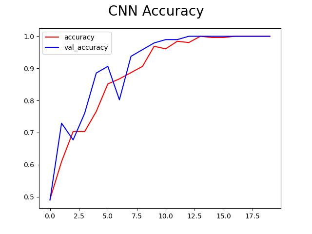

# Airplaines Classification
The goal of this project is to make a Convolucional Neural Network (CNN) that can classify what type of plane is represented in the image. Were chosen 2 types of airplaines: commercial and military. **Data were collected in the Google Images**. 

 

**Goal**
- Classify if it is an image of a commercial or military airplaine.